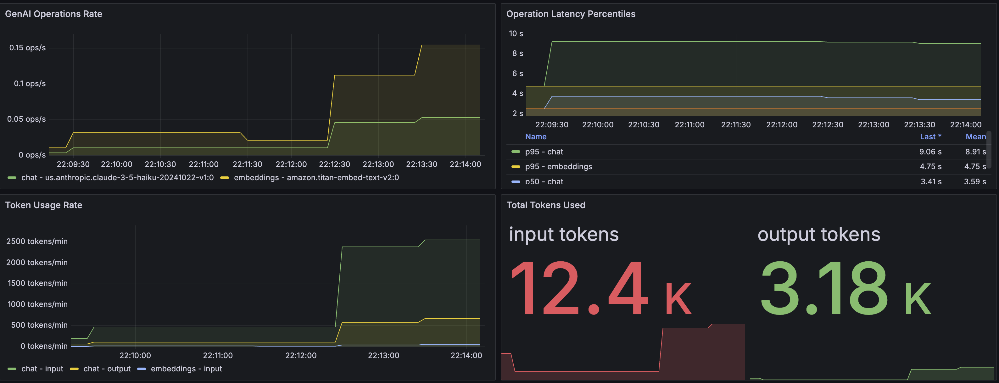
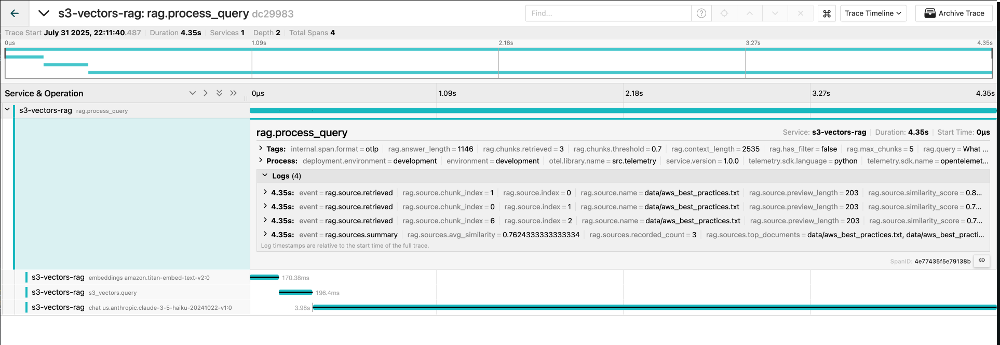

# AWS S3 Vectors RAG Application

A production-ready **Retrieval-Augmented Generation (RAG) pipeline** using AWS S3 Vectors and Amazon Bedrock. This application demonstrates how to build an intelligent document query system with AWS's new purpose-built vector storage service, complete with OpenTelemetry observability.

[](https://www.python.org/downloads/)
[](https://aws.amazon.com/s3/vectors/)
[](LICENSE)




## ✨ Features

- 🚀 **AWS S3 Vectors** - Purpose-built vector storage with S3-level durability
- 🤖 **Amazon Bedrock** - State-of-the-art embeddings and LLMs
- 📊 **OpenTelemetry** - Full observability with distributed tracing and metrics
- 🔍 **Semantic Search** - Find relevant documents using vector similarity
- ⚡ **High Performance** - Optimized for low latency and high throughput
- 🛡️ **Production Ready** - Error handling, retries, and monitoring
- 🔐 **Secure** - IAM-based access control and encryption support

## 🏗️ Project Structure

```
aws-rag-s3-vectors/
├── README.md                    # This file - setup and usage guide
├── requirements.txt             # Python dependencies
├── requirements.in              # Source dependencies for pip-compile
├── .env.example                 # Environment configuration template
├── docker-compose.yml           # Docker Compose configuration
├── Dockerfile                   # Docker image definition
├── otel-collector-config.yaml   # OpenTelemetry collector config
├── prometheus.yml               # Prometheus configuration
├── src/                         # Core application code
│   ├── __init__.py             # Package initialization
│   ├── app.py                  # FastAPI application (REST API)
│   ├── config.py               # Configuration management
│   ├── s3_vector_client.py     # S3 Vectors client wrapper
│   ├── ingest_service.py       # Document ingestion service
│   ├── rag_service.py          # RAG query processing service
│   └── telemetry.py            # OpenTelemetry instrumentation
│   
├── scripts/                     # Utility scripts
│   ├── ingest.py               # Document ingestion CLI
│   ├── test_api.py             # API testing suite
│   └── quickstart.py           # Quick start script
│   
├── data/                        # Sample documents
│   ├── aws_best_practices.txt  # AWS best practices document
│   └── sample_company_policy.txt # Sample company policy
│   
├── docs/                        # Documentation
│   ├── dashboard.png           # Grafana dashboard screenshot
│   ├── traces.png              # Jaeger traces screenshot
│   ├── GRAFANA_SETUP.md        # Grafana setup guide
│   ├── JAEGER_VIEWING_GUIDE.md # Jaeger viewing guide
│   └── SOURCE_TRACKING_TELEMETRY.md # Telemetry documentation
│   
├── grafana/                     # Grafana provisioning
│   └── provisioning/
│       ├── dashboards/         # Dashboard configurations
│       └── datasources/        # Datasource configurations
│   
├── logs/                        # Application logs directory
```

## 🚀 Quick Start

### Prerequisites

- **AWS Account** with S3 Vectors preview access
- **Python 3.10+**
- **AWS CLI** configured or IAM credentials

### 1. Install Dependencies

```bash
# Clone the repository
git clone https://github.com/ColeMurray/aws-rag-s3-vectors.git
cd aws-rag-s3-vectors

# Install dependencies
pip install -r requirements.txt

# Or regenerate requirements.txt from requirements.in
pip install pip-tools
pip-compile requirements.in
pip install -r requirements.txt
```

### 2. Configure Environment

Create a `.env` file based on `.env.example`:

```bash
cp .env.example .env
```

Edit `.env` with your settings:

```bash
# S3 Vectors Configuration
S3_VECTOR_BUCKET_NAME=my-vector-bucket
S3_VECTOR_INDEX_NAME=rag-index

# AWS Configuration
AWS_REGION=us-east-1

# Model Configuration (optional - defaults are fine)
BEDROCK_EMBED_MODEL_ID=amazon.titan-embed-text-v2:0
BEDROCK_LLM_MODEL_ID=us.anthropic.claude-3-5-haiku-20241022-v1:0
```

### 3. Ingest Documents

Place your text documents in the `data/` directory, then run:

```bash
python scripts/ingest.py data/
```

### 4. Start the API Server

```bash
# Using uvicorn directly
uvicorn src.app:app --reload --port 8000

# Or run the app module
python -m src.app
```

### 5. Test the API

```bash
# Run the test suite
python scripts/test_api.py

# Or test manually
curl -X POST "http://localhost:8000/query" \
  -H "Content-Type: application/json" \
  -d '{"query": "What is the remote work policy?"}'
```

## 📋 AWS Setup

### Enable S3 Vectors

S3 Vectors is currently in preview. Ensure you have access in your AWS region.

### Enable Bedrock Models

Enable these models in your AWS Bedrock console:
- **Titan Text Embeddings V2** (for embeddings)
- **Claude 3.5 Haiku** (for text generation)

### IAM Permissions

Your AWS credentials need these permissions:

```json
{
  "Version": "2012-10-17",
  "Statement": [
    {
      "Effect": "Allow",
      "Action": [
        "s3vectors:CreateVectorBucket",
        "s3vectors:CreateVectorIndex",
        "s3vectors:PutVectors",
        "s3vectors:QueryVectors",
        "s3vectors:GetVectors",
        "s3vectors:DeleteVectors",
        "s3vectors:ListVectors",
        "s3vectors:DescribeVectorBucket",
        "s3vectors:DescribeVectorIndex",
        "s3vectors:DescribeVectorIndexStats"
      ],
      "Resource": "*"
    },
    {
      "Effect": "Allow",
      "Action": [
        "bedrock:InvokeModel"
      ],
      "Resource": [
        "arn:aws:bedrock:*::foundation-model/amazon.titan-*",
        "arn:aws:bedrock:*::foundation-model/anthropic.claude-*"
      ]
    }
  ]
}
```

## 🔗 API Endpoints

### Query Documents
**POST** `/query`
```json
{
  "query": "What is the remote work policy?",
  "max_chunks": 5,
  "similarity_threshold": 0.7,
  "metadata_filter": {
    "file_name": "company_policy.txt"
  }
}
```

**Response:**
```json
{
  "answer": "Based on the documents...",
  "query": "What is the remote work policy?",
  "sources": [
    {
      "source": "./data/company_policy.txt",
      "chunk_index": 2,
      "similarity_score": 0.89,
      "text_preview": "Remote work is permitted..."
    }
  ],
  "processing_time_ms": 1250.5,
  "chunks_found": 3,
  "timestamp": "2024-01-15T10:30:00.000Z"
}
```

### Health Check
**GET** `/health`
```json
{
  "status": "healthy",
  "timestamp": "2024-01-15T10:30:00.000Z",
  "services": {
    "bedrock": "healthy",
    "s3_vectors": "healthy"
  }
}
```

### Index Statistics
**GET** `/stats`
```json
{
  "index_stats": {
    "total_vectors": 156,
    "dimension": 1024,
    "index_size": 524288
  },
  "timestamp": "2024-01-15T10:30:00.000Z"
}
```

### API Documentation
- **Swagger UI**: http://localhost:8000/docs
- **ReDoc**: http://localhost:8000/redoc

## 🚢 Deployment

### Docker

**Quick Start:**
```bash
# Local development with full observability stack
docker-compose up

# Production deployment
docker-compose up -d
```

**Features:**
- ✅ Auto-configured Grafana dashboard
- ✅ Pre-configured Prometheus datasource
- ✅ Full observability stack included
- ✅ No manual setup required

## 💰 Cost Estimation

### S3 Vectors Pricing
- **Storage**: ~$0.02 per GB per month
- **Requests**: ~$0.001 per 1,000 requests
- **No infrastructure management costs**

### Bedrock Pricing
- **Titan Embeddings**: ~$0.00001 per 1K input tokens
- **Claude 3.5 Haiku**: $0.001 per 1K input tokens, $0.005 per 1K output tokens

### Example Monthly Costs (Development)
- 100K documents ingested: ~$1
- 1000 queries/day: ~$3
- Storage (10GB vectors): ~$0.20
- **Total**: ~$5/month

## 🔧 Configuration Reference

### Environment Variables

| Variable | Required | Default | Description |
|----------|----------|---------|-------------|
| `S3_VECTOR_BUCKET_NAME` | ✅ | - | S3 Vectors bucket name |
| `S3_VECTOR_INDEX_NAME` | ❌ | "rag-index" | Vector index name |
| `S3_VECTOR_DIMENSION` | ❌ | 1024 | Vector dimension (must match embedding model) |
| `S3_VECTOR_DISTANCE_METRIC` | ❌ | "cosine" | Distance metric (cosine or euclidean) |
| `AWS_REGION` | ❌ | "us-east-1" | AWS region |
| `BEDROCK_EMBED_MODEL_ID` | ❌ | "amazon.titan-embed-text-v2:0" | Embedding model |
| `BEDROCK_LLM_MODEL_ID` | ❌ | "us.anthropic.claude-3-5-haiku-20241022-v1:0" | LLM model |
| `CHUNK_SIZE` | ❌ | 800 | Characters per text chunk |
| `CHUNK_OVERLAP` | ❌ | 100 | Overlap between chunks |
| `TOP_K` | ❌ | 6 | Number of chunks to retrieve |
| `SIMILARITY_THRESHOLD` | ❌ | 0.5 | Minimum similarity score |

## 🔍 Usage Examples

### Python Client
```python
import requests

# Query the API
response = requests.post("http://localhost:8000/query", json={
    "query": "What are the AWS security best practices?",
    "max_chunks": 3
})

result = response.json()
print(f"Answer: {result['answer']}")
print(f"Sources: {len(result['sources'])}")
```

### cURL Examples
```bash
# Basic query
curl -X POST "http://localhost:8000/query" \
  -H "Content-Type: application/json" \
  -d '{"query": "What is the expense reporting process?"}'

# Query with metadata filter
curl -X POST "http://localhost:8000/query" \
  -H "Content-Type: application/json" \
  -d '{
    "query": "AWS monitoring recommendations",
    "metadata_filter": {"file_name": "aws_best_practices.txt"}
  }'
```

## 🛠️ Troubleshooting

### Common Issues

#### OTEL Exporter Connection Errors in Docker
If you see errors like "Failed to export traces to localhost:4317":
- Ensure OTEL_EXPORTER_OTLP_ENDPOINT is NOT set in your `.env` file (comment it out)
- The Docker Compose automatically sets it to `http://otel-collector:4317`
- If issues persist, create a `docker-compose.override.yml` from the example file

#### "No module named 's3vectors'"
Ensure boto3 is updated to version 1.39.16 or later:
```bash
pip install -U boto3
```

#### Rate Limiting Errors
The client implements exponential backoff. If you still see errors:
- Reduce batch size in ingestion
- Add delays between requests
- Check S3 Vectors rate limits (5 writes/sec)

#### Empty Query Results
- Check similarity threshold (default 0.7)
- Verify vectors were ingested: `curl http://localhost:8000/stats`
- Try a lower threshold or broader query

#### Dimension Mismatch
Ensure all embeddings match the index dimension (1024 for Titan V2).

## 🔒 Security Best Practices

1. **Use IAM Roles** instead of access keys in production
2. **Enable encryption** on S3 Vectors bucket (SSE-S3 or SSE-KMS)
3. **Implement API authentication** for production
4. **Use HTTPS** for all API communications
5. **Sanitize inputs** to prevent injection attacks
6. **Store secrets** in AWS Secrets Manager or similar

## 📊 Observability with OpenTelemetry

This application includes comprehensive OpenTelemetry instrumentation following the GenAI semantic conventions.

### Features

- **Distributed Tracing**: Track requests across all components (Bedrock, S3 Vectors, RAG pipeline)
- **GenAI Semantic Conventions**: Standardized attributes for LLM operations
- **Metrics Collection**: Token usage, operation latencies, vector search performance
- **Privacy Controls**: Optional content capture for prompts/completions

### Configuration

Configure OpenTelemetry via environment variables:

```bash
# Enable/disable OpenTelemetry
OTEL_ENABLED=true

# Service identification
OTEL_SERVICE_NAME=s3-vectors-rag
OTEL_ENVIRONMENT=development

# OTLP exporter endpoint
OTEL_EXPORTER_OTLP_ENDPOINT=http://localhost:4317
OTEL_EXPORTER_OTLP_INSECURE=true

# Privacy settings
OTEL_CAPTURE_CONTENT=false  # Set to true to capture prompts/completions
OTEL_MAX_EVENT_CONTENT_LENGTH=1000
```

### Running with Observability Stack

The local development Docker Compose includes a full observability stack:

```bash
# Start everything including observability tools
docker-compose up -d
```

**Access the tools:**
- Jaeger UI: http://localhost:16686 - View distributed traces
- Prometheus: http://localhost:9090 - Query metrics
- Grafana: http://localhost:3000 - Visualize metrics (admin/admin)
  - **Dashboard and datasource are automatically configured!**
  - No manual setup required - just open Grafana and view the dashboard

### Key Metrics

- `gen_ai.client.token.usage` - Token consumption by operation
- `gen_ai.client.operation.duration` - GenAI operation latencies
- `rag.vector.search.duration` - Vector search performance
- `rag.chunks.retrieved.count` - Retrieved chunks per query

### Trace Attributes

Following OpenTelemetry GenAI semantic conventions:
- `gen_ai.system` - AI system (e.g., "aws.bedrock")
- `gen_ai.operation.name` - Operation type ("embeddings", "chat")
- `gen_ai.request.model` - Model identifier
- `gen_ai.usage.input_tokens` / `output_tokens` - Token counts
- `s3.vector.bucket` / `index` - S3 Vectors identifiers

### Example Traces

1. **RAG Query Processing**
   ```
   rag.process_query
   ├── embeddings amazon.titan-embed-text-v2:0
   ├── s3_vectors.query
   └── chat anthropic.claude-3-sonnet
   ```

2. **Document Ingestion**
   ```
   document.ingest
   ├── embeddings amazon.titan-embed-text-v2:0 (multiple)
   └── s3_vectors.upsert
   ```

## 📚 Additional Resources

- [AWS Bedrock Documentation](https://docs.aws.amazon.com/bedrock/)
- [FastAPI Documentation](https://fastapi.tiangolo.com/)

## 🤝 Contributing

1. Fork the repository
2. Create a feature branch
3. Make your changes
4. Add tests for new functionality
5. Submit a pull request

## 📄 License

This project is provided as-is for educational and reference purposes.

---

**🎯 Ready to get started?** Follow the Quick Start guide above!